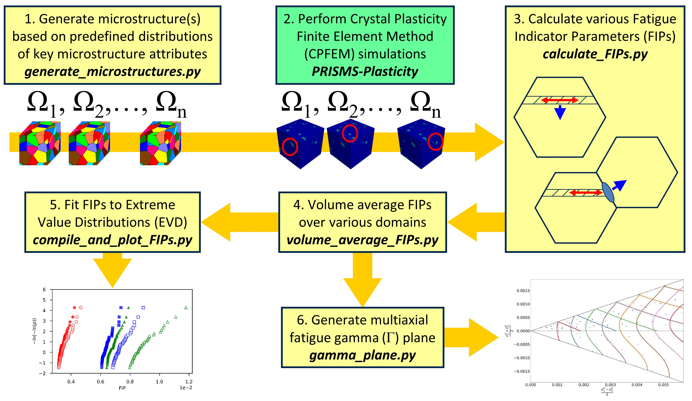

# PRISMS-Fatigue

<B>Code repository:</B> https://github.com/prisms-center/Fatigue 
<B>Code documentation:</B> https://github.com/prisms-center/Fatigue/tree/main/docs  
<B>Tutorial Videos:</B> https://www.youtube.com/playlist?list=PL4yBCojM4Swo3CvlA57syFrzk3p1mugP5  

<B>What is PRISMS-Fatigue?</B>

  PRISMS-Fatigue is an open-source fatigue analysis tool for polycrystalline metals and alloys. It uses PRISMS-Plasticity as the crystal plasticity finite element method (CPFEM) engine to simulate micromechanical microstructure response.
  
  This code is a collaborative effort between the University of Michigan's PRISMS Center and the David L. McDowell Research Group at the Georgia Institute of Technology (GT). GT's digital microstructure workflows developed in Python are integrated with PRISMS-Plasticity to investigate the fatigue response of polycrystalline metals and alloys.
  
  Please reach out to Krzysztof (Kris) or Mohammadreza (Reza) with any questions, concerns, or comments using the contact information listed below.
  
  
<B>Installation and documentation:</B> Please refer to the installation manual in the <B>docs</B> folder and the YouTube tutorial videos linked above.

<B>Python modules:</B>

  There are five scripts written in Python that users will execute:
  1. generate_microstructures.py
  2. calculate_FIPs.py
  3. volume_average_FIPs.py
  4. compile_and_plot_FIPs.py
  5. gamma_plane.py

  Variations of these scripts are available in the <B>applications</B> folder that are specific to certain manuscripts.

<B>Data sets:</B>

The data set associated with the PRISMS-Fatigue manuscript is available for download from Materials Commons at: https://doi.org/10.13011/m3-rcyy-gx13. Other data sets are available in the <B>applications</B> folder.

<B>References:</B>

  + M. Yaghoobi, K. S. Stopka, A. Lakshmanan, V. Sundararaghavan, J. E. Allison, and D. L. McDowell. PRISMS-Fatigue computational framework for fatigue analysis in polycrystalline metals and alloys. <I>npj Comput. Mater.</I>, <B>7</B>, 38 (2021).
  https://doi.org/10.1038/s41524-021-00506-8

  + M. Yaghoobi, S. Ganesan, S. Sundar, A. Lakshmanan, S. Rudraraju, J.E. Allison, and V. Sundararaghavan. PRISMS-Plasticity: An open-source crystal plasticity finite element software. <I>Comput. Mater. Sci.</I> <B>169</B>, 109078 (2019).
  https://doi.org/10.1016/j.commatsci.2019.109078

<B>License:</B>

  GNU Lesser General Public License (LGPL). Please see the file
  LICENSE for details.

<B>Forum:</B> 

For the time being, please direct question to the PRISMS-Plasticity users forum

   + https://groups.google.com/forum/#!forum/prisms-cpfe-users

<B>Mailing List:</B> 

 + prismsplasticity.users@umich.edu
 + prismsplasticity.dev@umich.edu  
 
 <B>Current Developers:</B>
 
 + Krzysztof S. Stopka stopka.kris@gmail.com, kstopka3@gatech.edu
 + Mohammadreza Yaghoobi Yaghoobi@umich.edu

<B>Further information, questions, issues and bugs:</B>

  Contact the developers at prismsplasticity.dev@umich.edu  
